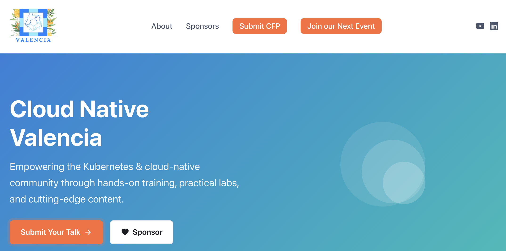

# Cloud Native Valencia Website

[](https://app.netlify.com/projects/cloud-native-valencia/deploys)

[https://cloudnativevalencia.com](https://cloudnativevalencia.com)  



Static website for the Cloud Native Valencia community, featuring YouTube integration, speaker profiles, sponsor showcase, and links to community resources.

## Website Sections

### Hero
- Main headline and community tagline
- Call-to-action buttons: "Submit Your Talk" (Sessionize) and "Sponsor" (GitHub Sponsors)
- Animated decorative graphics

### Videos
- Featured YouTube video embed
- Subscribe button linking to YouTube channel
- "View All Videos" button

### Call for Proposals (CFP)
- Information about submitting talks
- Deadlines and event details
- Talk formats: 30min talks, 60min workshops, 5min lightning talks
- Links to Sessionize for submissions

### About the Community
- Three pillars: Community-Driven, Hands-On Learning, Production Focus
- Connect with us links:
  - [LinkedIn](https://www.linkedin.com/company/cloud-native-valencia)
  - [CNCF Chapter](https://ocgroups.dev/cncf/group/y8z7qfd)
  - [Meetup](https://www.meetup.com/cloud-native-valencia/)

### Organizers
The team behind Cloud Native Valencia:
- Jade Lassery
- Luiz Bernardo Levenhagen
- Chad M. Crowell

### Sponsors
Current sponsors supporting the community:
- VictoriaMetrics
- Red Hat
- Flywire

"Become a Sponsor" button linking to GitHub Sponsors.

### Footer
- Community links
- Resource links (KubeSkills, Kubernetes Docs, CNCF)
- Social media icons (YouTube, LinkedIn, CNCF Chapter, Meetup)

### Floating "Support Us" Button
- Appears on scroll
- Links to GitHub Sponsors page


## Accessibility

- Semantic HTML5 elements
- ARIA labels on interactive elements
- Focus visible styles
- Skip to content link
- Keyboard navigation support
- Color contrast meets WCAG AA
- Alt text on all images
- Proper heading hierarchy

## Performance

- Minimal CSS/JS (no frameworks)
- Lazy loading images
- Preconnect to YouTube
- Scroll animation optimization
- Netlify CDN delivery

## License

MIT License

## Publishing a Blog Post

No local tooling required — everything happens on GitHub.

### 1. Fork the repository

1. Go to [https://github.com/CloudNativeValencia/cloudnativevalenciacom](https://github.com/CloudNativeValencia/cloudnativevalenciacom)
2. Click **Fork** in the top-right corner and select your personal GitHub account as the destination
3. GitHub creates a copy at `https://github.com/YOUR-USERNAME/cloudnativevalenciacom`

### 2. Create the file in your fork

1. In your fork, navigate to `hugo-blog/content/posts/`
2. Click **Add file → Create new file**
3. Name the file using lowercase words separated by hyphens — this becomes the URL slug, e.g. `my-new-post.md` → `cloudnativevalencia.com/blog/my-new-post/`

### 3. Write the post

Paste the following front matter at the top of the file, fill in each field, then write the post body in Markdown below the closing `---`:

```markdown
---
title: "Your Post Title Here"
date: 2026-05-04
description: "One sentence shown as the excerpt on the blog index."
author: "Your Name"
draft: false
tags: ["Community"]
---

Your post content here...
```

| Field | Description |
| --- | --- |
| `title` | Displayed as the post heading and in the blog index |
| `date` | Publication date in `YYYY-MM-DD` format |
| `description` | Short excerpt shown on the blog index page |
| `author` | Your name, displayed in the post metadata |
| `draft` | Set to `true` to save without publishing; change to `false` when ready |
| `tags` | Category label shown next to the date — e.g. `["Kubernetes"]`, `["Community"]`, `["Career"]` |

### 4. Create a new branch

1. After writing the post, scroll down to **Commit changes**
2. Give the commit a short title, e.g. `Add blog post: my-new-post`
3. Select **Create a new branch for this commit and start a pull request**
4. Name the branch something descriptive, e.g. `blog/my-new-post`
5. Click **Propose new file**

### 5. Open a pull request from your fork

1. On the **Open a pull request** screen that appears, review the title and description
2. Click **Create pull request**
3. A Netlify deploy preview is automatically generated — click the preview link in the PR checks to proofread the post before it goes live
4. View all open PRs here: [https://github.com/CloudNativeValencia/cloudnativevalenciacom/pulls](https://github.com/CloudNativeValencia/cloudnativevalenciacom/pulls)

### 6. Merge and publish

1. Once the PR is approved, click **Merge pull request**
2. Netlify detects the push to `main`, runs the Hugo build, and publishes within ~30 seconds
3. Post is live at `https://cloudnativevalencia.com/blog/my-new-post/`

> To update a published post, navigate to its `.md` file on GitHub, click the pencil icon to edit, and open a new PR with your changes.

## Contributing

1. Fork repository
2. Create feature branch
3. Make changes
4. Submit pull request

## Support

- **GitHub:** Open an issue
- **LinkedIn:** [Cloud Native Valencia](https://www.linkedin.com/company/cloud-native-valencia)
- **Meetup:** [Cloud Native Valencia](https://www.meetup.com/cloud-native-valencia/)

---

Built with love by the Cloud Native Valencia community
